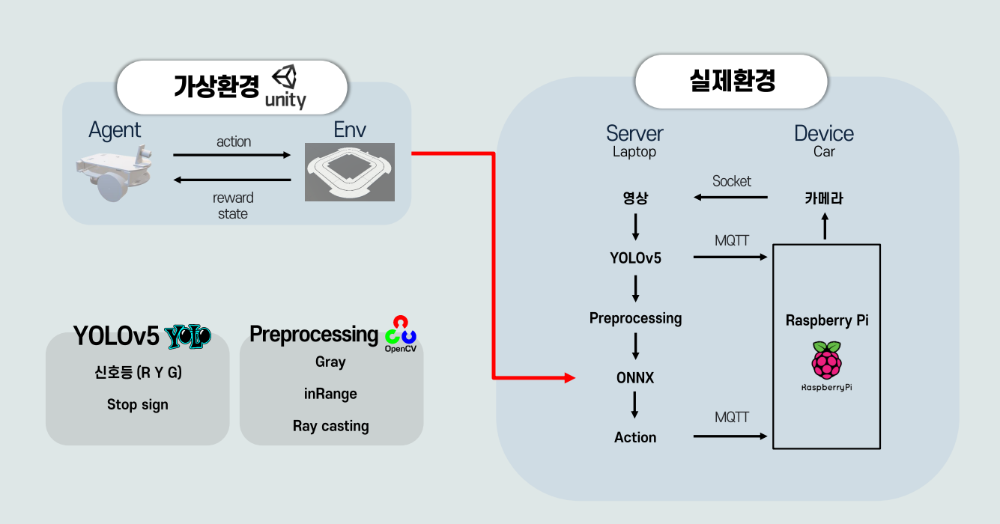
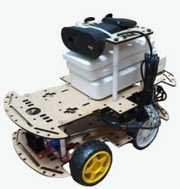
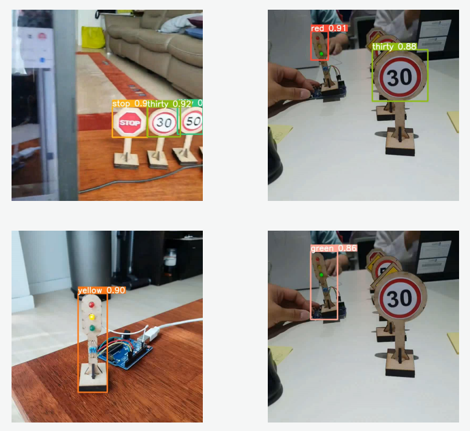

# Autonomous Driving Robot Server

강화학습 기반 자율주행 로봇의 서버 측 객체 인식 및 제어 처리를 담당하는 프로젝트입니다.

Unity ML-Agents 기반으로 학습한 모델을 실제 Raspberry Pi 기반 로봇에 적용하였으며,  
서버에서 객체 인식 및 판단을 수행하고 로봇은 제어에 집중하는 분산 구조로 설계했습니다.

`server_onnx.py`가 실제 메인 서버 역할을 수행하며,
YOLOv5 객체 인식, OpenCV 기반 전처리, ONNX Runtime 기반 추론,
Socket/MQTT 통신을 담당합니다.

---

# 프로젝트 개요

초기에는 Raspberry Pi 내부에서 직접 객체 인식 및 추론을 수행하려 했지만,
연산 성능 한계로 인해 프레임 처리 지연이 발생했고 실시간 제어가 어려웠습니다.

이를 해결하기 위해:

- 영상 처리 서버 분리
- Socket 기반 영상 스트리밍
- MQTT 기반 제어 명령 전달
- OpenCV 기반 전처리
- Canny Edge 기반 차선 특징 추출
- ONNX Runtime 기반 강화학습 추론

구조를 적용하여 실제 환경에서도 실시간 자율주행이 가능하도록 구성했습니다.

---

# 전체 시스템 구조



---

# 실제 로봇 환경

- Raspberry Pi 3B
- Webcam C270
- L298N Motor Driver
- DC Motor
- PWM 기반 속도 제어



---

# 시스템 흐름

```text
[Robot Camera]
        ↓
Socket Video Streaming
        ↓
[AI Server]
        ├── OpenCV Resize
        ├── Canny Edge
        ├── NumPy Mask Processing
        ├── YOLOv5 Detection
        ├── ONNX Inference
        └── Direction Decision
        ↓
MQTT Publish
        ↓
[Raspberry Pi Robot]
        ├── MQTT Subscribe
        ├── Motor Control
        └── Vehicle Movement
```

---

# 핵심 설계

## 1. 서버 / 로봇 분산 구조

초기 구현에서는 Raspberry Pi 내부에서 직접 객체 인식과 추론을 수행했습니다.

하지만 영상 처리와 추론을 동시에 수행하기에는 연산 성능이 부족했고,
프레임 처리 지연으로 인해 실시간 제어가 어려웠습니다.

이를 해결하기 위해:

- 로봇은 카메라 송신 및 제어 담당
- 서버는 객체 인식 및 판단 담당

으로 역할을 분리했습니다.

이를 통해 Raspberry Pi의 연산 부담을 줄이고,
실시간 제어 안정성을 높일 수 있었습니다.

---

## 2. Socket 기반 영상 스트리밍

영상 데이터는 지속적으로 대용량 프레임이 전송되어야 했기 때문에
HTTP 방식보다 실시간 스트리밍에 적합한 Socket 통신을 사용했습니다.

```text
Robot Camera
    ↓
Continuous Frame Stream
    ↓
Socket Server
```

이를 통해 지속적인 영상 스트림 처리가 가능하도록 구성했습니다.

---

## 3. MQTT 기반 제어 명령 전달

제어 명령은:

- 빠른 전달
- 경량 메시지 구조
- Publish / Subscribe 구조

가 중요했기 때문에 MQTT를 사용했습니다.

```text
AI Server
    ↓
MQTT Publish
    ↓
Robot Subscribe
```

이를 통해 객체 인식 결과를 빠르게 로봇 제어부로 전달할 수 있도록 구성했습니다.

---

## 4. OpenCV 기반 전처리 및 특징 추출

실제 환경에서는 조명과 노이즈로 인해
차선 인식 정확도가 낮아지는 문제가 발생했습니다.

이를 해결하기 위해:

- OpenCV Resize
- GrayScale 변환
- Canny Edge
- NumPy Mask 연산

을 활용하여 차선 특징을 추출했습니다.

```python
canny = cv2.Canny(
    cv2.cvtColor(img_resize, cv2.COLOR_BGR2GRAY),
    30,
    70
)
```

---

## 5. NumPy 기반 거리 특징 계산

Canny 결과 이미지에서 여러 방향의 mask를 생성하고,
각 방향별 거리 특징값을 계산했습니다.

```python
mask1 = np.block([dim3, dim2])
mask2 = np.block([dim9, dim2])
mask3 = np.block([dim8, lineH, dim7])
mask4 = np.block([dim7, dim10])
mask5 = np.block([dim2, dim3])
```

각 방향의 특징값은 다음과 같이 강화학습 모델 입력으로 사용했습니다.

```python
obs_1 = np.array(
    [[len1, len2, len3, len4, len5]]
).astype(np.float32)
```

이를 통해 카메라 기반 Ray-Casting과 유사한 방향 거리 정보를 구성했습니다.

---

# ONNX 기반 강화학습 추론

Unity ML-Agents 기반으로 학습한 강화학습 모델을
ONNX 형태로 변환하여 사용했습니다.

서버에서는 ONNX Runtime 기반으로 추론을 수행했습니다.

```python
output = sess.run(
    ["discrete_actions"],
    {
        "obs_0": Input,
        "obs_1": obs_1,
        "action_masks": np.array(
            [[1.,1.,1.,1.,1.]]
        ).astype(np.float32)
    }
)
```

모델은 다음 행동 중 하나를 선택합니다.

- stop
- go
- back
- left
- right

---

# YOLOv5 기반 객체 인식

YOLOv5 기반 객체 인식을 사용하여:

- 신호등
- 방향 표지판
- 제한 속도 표지판
- 정지 표지판

등을 인식할 수 있도록 구성했습니다.

## YOLOv5 Inference



---

# 프로젝트에서 고민한 점

## 실시간 처리 지연 문제

초기 구현에서는 프레임 처리 속도가 충분하지 못했고,
제어 명령 전달이 늦어져 실제 주행 안정성이 떨어졌습니다.

특히:

- 객체 인식
- 영상 전처리
- 강화학습 추론
- 제어 전달

이 하나의 장치에서 동시에 수행되면서 병목이 발생했습니다.

이를 해결하기 위해:

- 서버 분리 구조
- ONNX Runtime 기반 추론
- Socket / MQTT 역할 분리

를 적용했습니다.

---

## 카메라 기반 거리 특징 구성

실제 차량처럼 라이다 센서를 사용하는 대신,
카메라 영상 기반으로 방향 거리 특징을 구성해야 했습니다.

이를 위해:

- Canny Edge 기반 차선 검출
- NumPy Mask 연산
- 방향별 거리 특징 계산

을 통해 Ray-Casting과 유사한 입력 구조를 구현했습니다.

---

## 실시간성과 안정성 사이의 균형

실시간 제어에서는 오래된 데이터(stale frame)가 누적될 경우
잘못된 판단이 발생할 수 있었습니다.

이를 방지하기 위해:

- 최신 프레임 중심 처리
- 서버 판단 이후 제어 진행
- 제어 흐름 단순화

를 통해 안정성을 확보했습니다.

---

# 기술 스택

## AI / Vision

- YOLOv5
- ONNX Runtime
- OpenCV
- NumPy

## Communication

- Socket
- MQTT

## Hardware

- Raspberry Pi 3B
- Webcam C270
- L298N Motor Driver

## Training

- Unity ML-Agents
- PPO

---

# 프로젝트 구조

```text
Server
├── server_onnx.py        # 메인 서버
├── mqtt_test.py          # MQTT 테스트
├── socket_test.py        # Socket 테스트
├── yolo_test.py          # YOLOv5 테스트
├── image_processing.py   # 영상 처리 테스트
└── ...
```

---

# 프로젝트 의의

- Raspberry Pi의 제한된 연산 환경을 서버 분리 구조로 해결
- Socket과 MQTT를 목적에 따라 분리 사용
- 강화학습 기반 모델을 실제 환경에 배포
- Unity 가상환경 학습 결과를 실제 환경으로 적용
- 카메라 기반 자율주행 구조 구현
- NumPy 기반 방향 특징 추출 구현

---

# 개선 가능 사항

- 다중 로봇 처리 구조 확장
- Worker 기반 분산 처리
- Frame Queue 최적화
- GPU 기반 추론 구조 추가
- MQTT QoS 전략 세분화
- Timestamp 기반 stale frame 제거 강화

---

# 배운 점

- 제한된 환경에서의 시스템 설계
- 실시간 처리 구조 설계
- Socket과 MQTT의 역할 분리
- ONNX 기반 추론 구조
- OpenCV 기반 영상 처리
- NumPy 기반 특징 추출
- 서버-로봇 구조 분리 설계
- 실시간성과 안정성 사이의 트레이드오프
